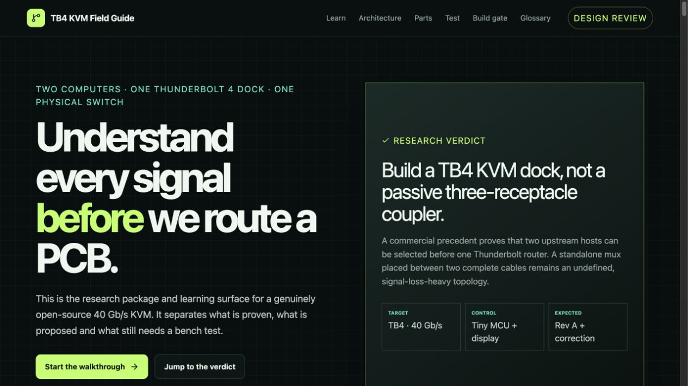
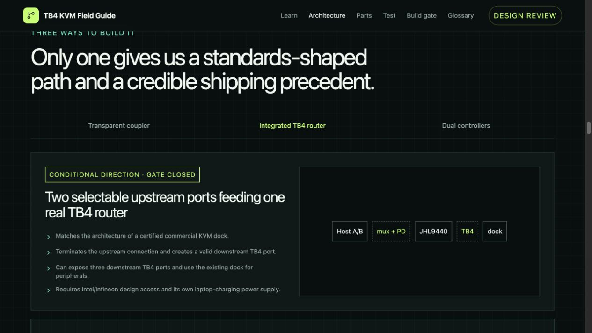

# TB4 KVM

[](https://github.com/0x63616c/tb4-kvm/actions/workflows/check.yml)
[](PROJECT-STATUS.md)
[](LICENSE.md)
[](LICENSE.md)

An evidence-gated, open-source Thunderbolt 4 KVM: two computers, one real TB4 dock, one physical switch, no host software.

**[Open the interactive field guide](https://0x63616c.github.io/tb4-kvm/)** · **[Browse project files and evidence](https://0x63616c.github.io/tb4-kvm/project/)**



> [!IMPORTANT]
> This is real hardware engineering in public, currently at design review—not a finished 40 Gb/s product. No PCB is order-ready yet. Every status and blocker is tracked in [`evidence/ledger.json`](evidence/ledger.json).

## What we are building

```text
Host A USB-C ── PD/CC A ──┐
                          ├── 4-pair high-speed mux ── real TB4 router ── downstream TB4 ── dock
Host B USB-C ── PD/CC B ──┘                │
                                           ├── orientation-aware USB2/SBU routing
                                           └── protected power + MCU + button/display header
```

The key design decision is what this project **is not**: a passive three-receptacle USB-C coupler. A credible TB4 KVM selects one upstream front end before a real Thunderbolt router while keeping Host A and Host B CC/PD/VBUS domains isolated.



## Current state

| Artifact | State | Evidence |
| --- | --- | --- |
| Beginner field guide and terminology | `MODELED` | [`app/field-guide.tsx`](app/field-guide.tsx) |
| Product architecture | `REVIEWED` | [`docs/ARCHITECTURE-DECISION.md`](docs/ARCHITECTURE-DECISION.md) |
| Safety/control ordering | `MODELED` | [`design/control-state-machine.json`](design/control-state-machine.json) |
| PCB-1A RF mux coupon | `BLOCKED` | [`docs/PCB-1-DEFINITION.md`](docs/PCB-1-DEFINITION.md) |
| Integrated TB4 KVM PCB | `BLOCKED` | [`docs/DESIGN-READINESS-CHECKLIST.md`](docs/DESIGN-READINESS-CHECKLIST.md) |
| Parametric enclosure/mount | `BLOCKED` | [`docs/CAD-RELEASE-CONTRACT.md`](docs/CAD-RELEASE-CONTRACT.md) |

PCB-1A is deliberately an RF measurement coupon with no USB-C receptacle, VBUS, CC, PD or protocol link. Its proposed minimum measurement setup is a calibrated four-port VNA to 20 GHz; the coupon itself remains no-go until vendor models, lab access, channel limits and a frozen PCBWay construction exist. PCB-1A measurement is not a blocker for prototype A: the project now follows the documented [prototype-first validation route](docs/decisions/2026-09-01-prototype-first-validation.md) with narrower claims and an expected correction revision.

## Explore and run the field guide

Requirements: Node.js 22+ and npm.

```bash
git clone https://github.com/0x63616c/tb4-kvm.git
cd tb4-kvm
npm ci
npm run dev
```

Open `http://localhost:3000`. Run the complete repository gate with:

```bash
npm run check
```

The check suite covers formatting, lint, TypeScript, control-state invariants, the PCB-1A measurement-plan contract, evidence/link integrity, dependency audit, CycloneDX SBOM and a production build. Passing these checks proves repository consistency—not electrical safety or 40 Gb/s operation.

## Build path

Start with the [beginner build and contribution guide](docs/BUILD-GUIDE.md). The project proceeds in evidence-gated stages:

1. Learn the connector, protocol and safety boundaries in the field guide.
2. Close exact-parts, lab and fabricator questions for PCB-1A.
3. Build and measure the RF-only mux coupon; retain raw Touchstone evidence.
4. In parallel, prototype the PD-free controller/button/display board.
5. Prove reference-backed Type-C/PD/power behavior on protected lab equipment—never first on laptops.
6. Design and bring up the integrated KVM, expecting a measured correction revision.
7. Freeze the board geometry, then release parametric enclosure, mount and remote-pod CAD.

Useful starting documents:

- [Live execution map and parallel work lanes](docs/EXECUTION-MAP.md)
- [End-to-end project plan](docs/PROJECT-PLAN.md)
- [Product requirements](docs/PRODUCT-REQUIREMENTS.md)
- [USB-C/TB4 architecture decision](docs/ARCHITECTURE-DECISION.md)
- [Signal and power ownership](docs/SIGNAL-POWER-OWNERSHIP.md)
- [PCB-1A measurement method](docs/PCB-1A-MEASUREMENT-METHOD.md)
- [Exact PCB-1A candidate-parts evidence](docs/PCB-1A-PARTS-EVIDENCE.md)
- [PCBWay pre-quote inquiry](docs/PCBWAY-PREQUOTE-INQUIRY.md)
- [Validation plan](docs/VALIDATION-PLAN.md)
- [Review and release policy](docs/REVIEW-AND-RELEASE-POLICY.md)

## Repository map

```text
app/          interactive learning and project-status site
design/       machine-readable control and measurement models
docs/         requirements, decisions, research, guides and reviews
evidence/     authoritative project evidence ledger
hardware/     KiCad sources and immutable releases as they become real
mechanical/   parametric CAD sources and verified exports as they become real
scripts/      reproducible repository and evidence checks
```

PCB and 3D previews will be added to the site and README only from real, revisioned source files. Placeholder renders are never presented as manufactured, measured or printable hardware.

## Contributing

Read [`AGENTS.md`](AGENTS.md) before changing the project. Preserve evidence labels, use primary sources, record independent reviews, and do not weaken a safety or manufacturing gate to make the project appear further along.

Hardware is licensed under CERN-OHL-S-2.0, software under MIT, and documentation under CC BY-SA 4.0; see [`LICENSE.md`](LICENSE.md).
